# FULL_PROJECT_LIFECYCLE_GUIDE.md — NEXORA Complete Lifecycle Roadmap (V1 ➔ V-FINAL)

> **Project Name:** NEXORA (Next-generation Explainable Route Optimization & Retrieval Assistant)  
> **Team:** Adarsh (`adarshmen0n` — Lead Architect) & Dhanushya (`Dhanushya-lzs13` — Lead Feature Engineer)  
> **Target Scope:** From Initial V1 Telemetry Foundation to Complete Final Municipal Production Release  
> **Antigravity AI Contract:** Permanent operating blueprint until total project completion.  

---

## 🎯 1. The Definition of "Project Complete"

NEXORA will be considered **100% Complete and Production-Finished** when the following criteria are satisfied:

1. **Multi-Role Single Page Application (SPA)** operating seamlessly across Desktop and Mobile (iOS Safari / Android Chrome).
2. **Real-time Multi-Fleet Tracking**: Multiple concurrent buses operating across Coimbatore transit corridors with genuine hardware GNSS streaming.
3. **Strict 2-Step Emergency Safety Network**: Real-time victim SOS dispatch with a 35.0 km geofence, dynamic Haversine distance, and 10 km tactical POIs.
4. **Digital Transit Ticketing & QR Validation**: Commuter QR boarding passes with simulated fare deductions and driver validation scans.
5. **AI Predictive Arrival Engine (Explainable ETA)**: Real-time delay compensation factoring in stop dwell times and traffic speed variances.
6. **Municipal Operations Command Center**: High-level transit authority dashboard with fleet heatmaps, on-time performance metrics, and emergency response forensics.
7. **Hardware IoT Gateway Compatibility**: Direct ingestion of GPS telemetry packets from ESP32 / SIM800L / Neo-6M microcontrollers.
8. **Automated CI/CD Quality Pipeline**: GitHub Actions running automated test suites (targeting 40+ tests across all subsystems) with 100% green status.
9. **Final Capstone Deliverables**: Complete academic project report / thesis, presentation slides (`NEXORA.pptx`, `NEXORA.pdf`), architecture documentation, and recorded live demo walkthrough.

---

## 🗺️ 2. The 5-Phase Evolutionary Roadmap

```mermaid
flowchart TD
    subgraph Phase1["Phase 1: V1.0.0 Baseline (COMPLETED)"]
        P1_1["Unified 4-Role SPA"]
        P1_2["Genuine Mobile GNSS GPS"]
        P1_3["Strict 2-Step Emergency SOS"]
        P1_4["Tactical Responder Radar (35km)"]
        P1_5["21 Passing Tests & Render Live"]
    end

    subgraph Phase2["Phase 2: V2.0.0 Fleet Scaling & PWA (CURRENT)"]
        P2_1["Multi-Bus Fleet Tracking"]
        P2_2["In-Cab Bus Crowding Sensors"]
        P2_3["Terminal Timetable & Schedules"]
        P2_4["Offline PWA Service Worker"]
        P2_5["Driver Schedule Adherence"]
    end

    subgraph Phase3["Phase 3: V3.0.0 Smart Transit & QR Ticketing"]
        P3_1["Digital QR Transit Pass"]
        P3_2["Driver QR Scanner Engine"]
        P3_3["AI Delay & ETA Predictor"]
        P3_4["Coimbatore Trip Route Planner"]
        P3_5["Multi-channel SMS/Push Alerts"]
    end

    subgraph Phase4["Phase 4: V4.0.0 Municipal Command & IoT Gateway"]
        P4_1["City Transit Command Radar"]
        P4_2["Fleet Utilization Heatmaps"]
        P4_3["Hardware IoT GPS Gateway (ESP32)"]
        P4_4["PostgreSQL + Redis Migration"]
        P4_5["Incident Forensics & Response Analytics"]
    end

    subgraph Phase5["Phase 5: V-FINAL Institutional Hardening & Defense"]
        P5_1["Automated CI/CD Pipeline (GitHub Actions)"]
        P5_2["Stress Testing (100+ Concurrent Nodes)"]
        P5_3["Security & Penetration Audit"]
        P5_4["Capstone Thesis & Final Defense Presentation"]
        P5_5["Official Production Tag v-final"]
    end

    Phase1 --> Phase2
    Phase2 --> Phase3
    Phase3 --> Phase4
    Phase4 --> Phase5
```

---

## 👥 3. Team Responsibility Matrix (Adarsh & Dhanushya)

To avoid merge collisions and ensure steady progress, duties are clearly divided across all phases:

| Phase | Adarsh (`adarshmen0n`) Responsibilities | Dhanushya (`Dhanushya-lzs13`) Responsibilities |
| :--- | :--- | :--- |
| **Phase 1: V1 Baseline** *(Done)* | Core FastAPI engine, SQLite DB, JWT security, 21 tests, Render deployment | Mobile testing, UI review, repository collaboration setup |
| **Phase 2: V2 Fleet & PWA** | Backend multi-bus API scaling, fleet state cache, database schema extensions | Frontend multi-bus marker rendering, crowding toggles, PWA manifest & service worker |
| **Phase 3: V3 Smart Transit** | QR token cryptographic signing, fare validation API, AI predictive delay algorithms | Frontend QR pass generation, camera QR scanner, trip planner search UI |
| **Phase 4: V4 Command & IoT** | IoT microcontroller packet ingestion endpoint, PostgreSQL schema migration, Redis caching | Admin Command Center UI, fleet analytics charts (Chart.js), incident timeline reports |
| **Phase 5: V-FINAL Release** | CI/CD GitHub Actions, load testing scripts, system security audit, production deployment | Final user documentation, slide deck (`NEXORA.pptx`), demo video script, capstone report |

---

## 📋 4. Detailed Phase Breakdown & Milestones

### Phase 1: V1.0.0 — Production Baseline & Telemetry (Status: ✅ COMPLETED)
- **Status:** 100% Verified, Tagged `v1.0.0` at commit `418280a`.
- **Delivered Capabilities:**
  - 4 unified roles (`ADMIN`, `DRIVER`, `PASSENGER`, `RESPONDER`) in one single URL.
  - Hardware mobile GPS tracking via `navigator.geolocation.watchPosition` with zero fake coordinates.
  - Two-step confirmed emergency SOS with 3-second safety countdown.
  - Responder tactical radar auto-centering on victim within 35.0 km Coimbatore coverage.
  - Multi-tier hybrid reverse geocoder (OSM Nominatim + Coimbatore POI registry).
  - 21 passing automated tests in `tests/`.
  - Render cloud production deployment live at `https://nexora-v1.onrender.com/`.

---

### Phase 2: V2.0.0 — Fleet Scaling, Passenger Experience & PWA (Status: 🔄 ACTIVE)
- **Primary Branch:** `dhanushya-v2` / `adarsh-work`
- **Target Tag:** `v2.0.0`
- **Milestones:**
  1. **Multi-Bus Fleet Telemetry**:
     - Expand database to support multiple active buses simultaneously (`BUS-001`, `BUS-002`, `BUS-003`).
     - Render multiple bus markers on the Leaflet map with unique route colors and directional headings.
  2. **In-Cab Passenger Crowding Sensor**:
     - Add `occupancy_level` (`seats_available`, `standing_only`, `full`) to `Bus` model.
     - Add 1-tap occupancy selector in the Driver Cockpit.
     - Display live crowd badge on Passenger tracking view.
  3. **Terminal Departure Timetables**:
     - Display upcoming departure schedules from Coimbatore terminals (Gandhipuram, Ukkadam, Singanallur).
  4. **Progressive Web App (PWA)**:
     - Add `manifest.json` with transit app icons and theme color `#064e3b`.
     - Implement Service Worker (`sw.js`) for offline caching of bus stops, emergency contact numbers, and UI assets.
- **Verification Criteria:**
  - 6 new automated tests in `tests/test_v2_fleet_and_pwa.py`.
  - All 27 tests passing.

---

### Phase 3: V3.0.0 — Smart Transit Intelligence & Digital QR Ticketing
- **Primary Branch:** `feature/v3-smart-transit`
- **Target Tag:** `v3.0.0`
- **Milestones:**
  1. **Digital Transit Pass & QR Generation**:
     - Passengers can generate a temporary cryptographically signed QR ticket for a selected route.
     - Fare calculation based on stop-to-stop distance (₹5 base + ₹1.5 per km).
  2. **Driver In-Cab QR Validator**:
     - Driver cockpit features a camera-based QR scanner (using `html5-qrcode` library) to validate boarding passes.
     - Instant visual confirmation (Green = Valid, Red = Expired / Already Used).
  3. **Explainable AI Predictive Arrival (ETA)**:
     - Algorithmic ETA model factoring in average stop dwell time (45 seconds), current vehicle speed, and historical rush-hour multipliers.
     - Clear breakdown in Passenger UI: `"Arriving in 8 mins (4.2 km away • 2 stops remaining • Moderate traffic)"`.
  4. **Coimbatore Multi-Hop Route Planner**:
     - Commuters input Origin and Destination; engine returns optimal direct or transfer routes with total travel time.
- **Verification Criteria:**
  - 8 new automated tests in `tests/test_v3_ticketing_and_eta.py`.
  - All 35 tests passing.

---

### Phase 4: V4.0.0 — Municipal Transit Command Center & IoT Gateway
- **Primary Branch:** `feature/v4-municipal-command`
- **Target Tag:** `v4.0.0`
- **Milestones:**
  1. **City Transit Authority Master Command Center**:
     - High-density tactical dashboard for municipal administrators.
     - Heatmap overlay of commuter demand, congested corridors, and active emergency zones.
  2. **Hardware IoT GPS Gateway**:
     - Ingestion endpoint: `POST /api/v1/iot/telemetry`.
     - Supports raw telemetry packets from ESP32 / SIM800L / GPS Neo-6M modules via HTTP or MQTT.
     - Packet format: `{"device_id": "IOT-BUS-01", "lat": 11.0168, "lon": 76.9674, "speed": 34.2, "checksum": "..."}`.
  3. **Enterprise Database & Caching**:
     - Migration scripts from SQLite to PostgreSQL.
     - Redis pub/sub integration for high-frequency GPS coordinate broadcasts.
  4. **Emergency Incident Forensics**:
     - Incident timeline logs: Timestamp of SOS trigger, time to responder acceptance, time to arrival, resolution notes.
- **Verification Criteria:**
  - 6 new automated tests in `tests/test_v4_command_and_iot.py`.
  - All 41 tests passing.

---

### Phase 5: V-FINAL — Institutional Hardening & Final Capstone Defense
- **Primary Branch:** `main` (Merge via Pull Request)
- **Target Tag:** `v-final` (or `v5.0.0`)
- **Milestones:**
  1. **Automated CI/CD Pipeline (GitHub Actions)**:
     - Automated workflow `.github/workflows/ci.yml` running on every commit and PR.
  2. **Stress & Concurrency Benchmarking**:
     - Load testing simulating 50 concurrent buses and 500 active passenger GPS streams without frame drops.
  3. **Security Audit**:
     - OWASP Top 10 compliance: rate limiting on auth and SOS endpoints, CORS origin restriction, XSS sanitation.
  4. **Academic Project Report & Presentation Deliverables**:
     - Comprehensive Project Documentation (System Architecture, ER Diagrams, Algorithm Flowcharts).
     - Final Presentation Slides (`NEXORA.pptx` and `NEXORA.pdf`).
     - Scripted Live Demonstration Video / Screencast for project evaluators.
- **Verification Criteria:**
  - 100% of test suite passing (41+ tests).
  - Production deployment on Render reporting 100% uptime.

---

## 🛠️ 5. Long-Term Antigravity AI Operating Contract

Whenever Adarsh or Dhanushya invokes Antigravity on their computer:

1. **Always read `AGENTS.md` and `FULL_PROJECT_LIFECYCLE_GUIDE.md` first.**
2. **Never break existing functionality**: Every new version must strictly build upon the previous version without deprecating working features.
3. **Commit often with clear scopes**:
   - `feat(v2-fleet): ...`
   - `feat(v3-qr): ...`
   - `feat(v4-command): ...`
4. **Pre-push testing is mandatory**: Never push to any remote branch if `python -m pytest tests/ -v` fails.
5. **No Force Pushing**: Keep Git history intact and cleanly auditable.
