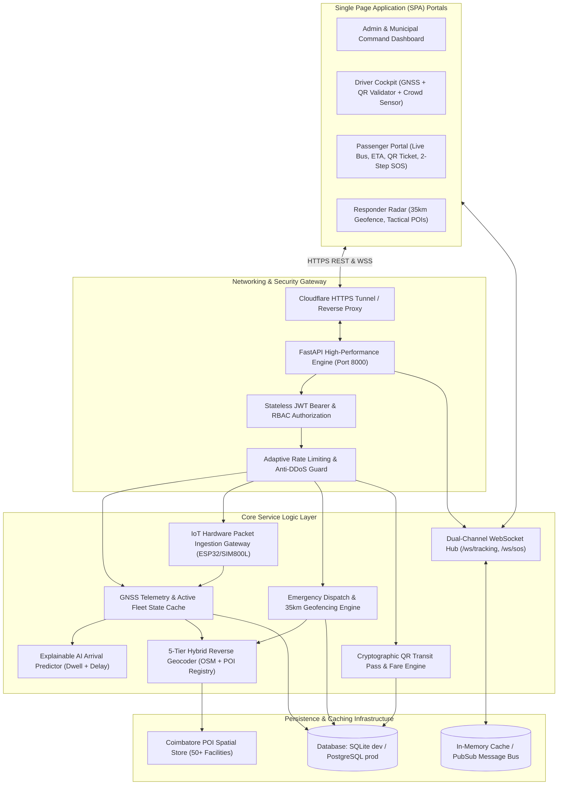

# PROJECT_CONTEXT.md — NEXORA Complete Architecture & Engineering Blueprint

> **System Name:** NEXORA (Next-generation Explainable Route Optimization & Retrieval Assistant)  
> **Lifecycle Scope:** V1 Baseline ➔ V2 Fleet Scaling ➔ V3 Smart Transit ➔ V4 Municipal Command ➔ V-FINAL Production Finish  
> **Domain:** AI-Powered Smart Municipal Public Transit & Tactical Emergency Rescue Network  
> **Primary Operating Region:** Coimbatore Metropolitan Area, Tamil Nadu, India  

---

## 1. System Overview & Core Mission

NEXORA is a next-generation public transportation and emergency dispatch platform engineered specifically for municipal transit operations in India. It unites transit authorities, fleet operators, daily commuters, and emergency first-responders into an intelligent, real-time operating ecosystem.

The platform progresses through five structured architectural phases:
1. **V1.0.0 (Baseline):** 4-Role Unified SPA, Hardware GNSS Mobile GPS, 35 km Geofenced SOS, 21 automated tests.
2. **V2.0.0 (Fleet & PWA):** Multi-bus tracking, in-cab crowd sensor, timetables, and offline PWA service worker.
3. **V3.0.0 (Smart Transit):** Digital QR ticketing, driver QR scanner, explainable AI arrival prediction (ETA).
4. **V4.0.0 (Command & IoT):** Municipal Command Center radar, ESP32 hardware IoT gateway, PostgreSQL migration.
5. **V-FINAL (Production):** Stress testing, OWASP security audit, CI/CD automated pipeline, capstone defense.

---

## 2. Comprehensive System Architecture (V1 through V-FINAL)



---

## 3. Technology Stack & Evolution Matrix

| Layer | V1 Baseline (Current) | V2 ➔ V3 Evolution | V4 ➔ V-FINAL Production |
| :--- | :--- | :--- | :--- |
| **Backend** | FastAPI + Uvicorn (Python 3.12) | FastAPI async background tasks | FastAPI + Gunicorn workers + Docker |
| **Database** | SQLite (`nexora.db`) | SQLite with Alembic migrations | PostgreSQL with connection pooling |
| **Cache / Broker** | Python in-memory dictionaries | In-memory LRU cache | Redis Cache + Pub/Sub channel |
| **Frontend** | Vanilla ES6+ SPA, Leaflet.js | + PWA Service Worker (`sw.js`) | + Chart.js municipal analytics dashboard |
| **Ticketing** | Informational tracking | Cryptographic QR generator & scanner | Multi-stop fare calculation & digital receipt |
| **Telemetry** | Browser GNSS (`watchPosition`) | Multi-bus concurrent state engine | Hardware IoT Gateway (ESP32 / SIM800L) |
| **Testing** | 21 Pytest integration tests | 27+ Pytest tests | 45+ Tests + GitHub Actions CI/CD |

---

## 4. Default System Credentials & RBAC Roster

| Role | Role Code | Email | Password | Primary Operations |
| :--- | :--- | :--- | :--- | :--- |
| **👑 Admin Host** | `ADM-001` | `admin@nexora.local` | `Password123` | Master operations radar, fleet allocation, emergency logs |
| **🚍 Driver** | `DRV-001` | `driver@nexora.local` | `Password123` | Mobile cockpit for **Bus BUS-001**, start/stop trips, crowd toggle |
| **📱 Passenger** | `PAX-001` | `passenger@nexora.local` | `Password123` | Real-time tracking, live ETA, QR boarding pass, 2-Step SOS |
| **🚨 Responder** | `RSP-001` | `responder@nexora.local` | `Password123` | Tactical rescue console with **35.0 km radius**, audible siren, POIs |

---

## 5. Mathematical & Algorithmic Specifications

### A. Haversine Great-Circle Distance
All spatial distances between vehicles, commuters, and responders are calculated using the spherical Haversine formula:
$$\Delta\phi = \phi_2 - \phi_1, \quad \Delta\lambda = \lambda_2 - \lambda_1$$
$$a = \sin^2\left(\frac{\Delta\phi}{2}\right) + \cos\phi_1 \cos\phi_2 \sin^2\left(\frac{\Delta\lambda}{2}\right)$$
$$c = 2 \cdot \text{atan2}\left(\sqrt{a}, \sqrt{1-a}\right)$$
$$d = R \cdot c \quad (R = 6371.0 \text{ km})$$

### B. Explainable AI Arrival Prediction (ETA)
The estimated arrival time is computed explainably using:
$$\text{ETA}_{\text{minutes}} = \left(\frac{d_{\text{remaining}}}{v_{\text{live}}} \times 60\right) + \left(N_{\text{stops\_remaining}} \times t_{\text{dwell}}\right) + \Delta_{\text{congestion}}$$
- $d_{\text{remaining}}$: Road/Euclidean distance along remaining route stops (km).
- $v_{\text{live}}$: Live rolling average bus speed (km/h) clamped to $[10.0, 50.0]$.
- $N_{\text{stops\_remaining}}$: Number of scheduled bus stops between bus and passenger.
- $t_{\text{dwell}}$: Average stop dwell time ($0.75 \text{ mins}$ / $45 \text{ seconds}$).
- $\Delta_{\text{congestion}}$: Corridor rush-hour traffic multiplier factor.

---

## 6. Directory Structure & Key Files

```
NEXORA_V1_OFFICIAL_FINAL/
├── .github/
│   └── workflows/
│       └── ci.yml                # Automated GitHub Actions test pipeline
├── backend/
│   ├── config.py                 # System configuration & geofencing thresholds
│   ├── database.py               # SQLAlchemy database session & engine
│   ├── main.py                   # FastAPI app, static mounts, WebSocket hub
│   ├── security.py               # PBKDF2 password hashing & JWT token security
│   ├── models/                   # SQLAlchemy entity models (User, Bus, Route, SOS, Trip)
│   ├── schemas/                  # Pydantic validation schemas
│   ├── services/                 # Business logic: Geocoding, Haversine, Tracking, WebSockets
│   └── routers/                  # REST API endpoints (auth, buses, routes, tracking, sos, pois)
├── frontend/
│   ├── index.html                # Unified Single-Page Application
│   ├── style.css                 # Dark transit theme (Coimbatore emerald/navy styling)
│   ├── app.js                    # Core SPA state machine & Leaflet map engine
│   ├── auth.js                   # Client authentication & token storage
│   ├── coimbatore_pois.js        # 50+ Coimbatore POIs (Hospitals, Police, Fire)
│   └── (role subfolders)         # Modular UI sub-views
├── tests/                        # Automated Pytest suite (21 passing tests)
├── seed.py                       # Idempotent database seeder
├── run_nexora.py                 # Multi-platform local launcher
├── start_all.bat                 # Windows 1-click launcher
├── start_simulation.bat          # Synthetic GPS drive simulator launcher
├── start_tunnel.bat              # Cloudflare worldwide HTTPS tunnel launcher
├── AGENTS.md                     # Permanent AI Operating Contract
├── CHANGELOG.md                  # Release history (v1.0.0 through v-final)
├── FULL_PROJECT_LIFECYCLE_GUIDE.md # Complete master roadmap to project finish
├── PROJECT_CONTEXT.md            # This architecture blueprint
├── V1_TO_V2_HANDOFF.md           # Handoff briefing for Dhanushya
├── README.md                     # Master developer guide
└── .env.example                  # Environment variable template
```
