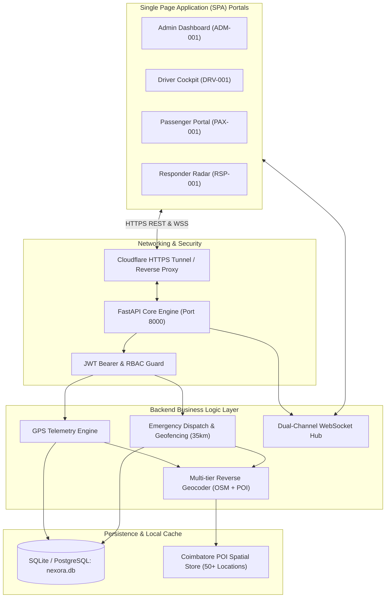

# PROJECT_CONTEXT.md — NEXORA Technical Architecture Blueprint

> **System Name:** NEXORA (Next-generation Explainable Route Optimization & Retrieval Assistant)  
> **Version:** `1.0.0` (Protected Baseline)  
> **Domain:** Smart Public Transit Fleet Telemetry & Tactical Emergency Rescue Dispatch  
> **Primary Region of Operation:** Coimbatore Metropolitan Area, Tamil Nadu, India  

---

## 1. System Overview & Core Purpose

NEXORA is a high-reliability, real-time public transit tracking and emergency management system designed for municipal bus operations in India. It replaces disparate legacy transport apps with a single, unified web platform integrating four core user roles:

1. **Transit Administration:** Master fleet monitoring, driver status, schedule enforcement, and incident oversight.
2. **Bus Operators (Drivers):** Dedicated in-cab mobile cockpit providing turn-by-turn route adherence, stop telemetry, and active passenger count tracking.
3. **Commuters (Passengers):** Live bus arrival estimates (ETA), hardware GNSS vehicle pinpointing, stop notifications, and a strictly guarded 2-step emergency SOS system.
4. **Emergency Responders:** Tactical rescue dispatch radar receiving audible alerts, live victim GPS coordinates, reverse-geocoded street addresses, and an interactive 10 km tactical POI overlay (hospitals, police stations, fire brigades).

---

## 2. High-Level Architecture Diagram



---

## 3. Technology Stack

| Layer | Component | Specification |
| :--- | :--- | :--- |
| **Backend Framework** | FastAPI | Python 3.12, async endpoints, Pydantic data schemas |
| **ASGI Web Server** | Uvicorn | High-performance asynchronous HTTP & WebSocket server |
| **Database ORM** | SQLAlchemy | Declarative ORM supporting SQLite (dev) and PostgreSQL (prod) |
| **Authentication** | Passlib & Python-Jose | PBKDF2-SHA256 password hashing, stateless HMAC-SHA256 JWT |
| **Real-time Protocol** | WebSockets | Dedicated channels for bus GPS streaming and instant SOS broadcast |
| **Frontend Framework** | Modern Vanilla JS | Zero-build ES6+, CSS3 responsive variables, dynamic DOM rendering |
| **Mapping Engine** | Leaflet.js | OpenStreetMap tiles, custom SVG markers, dynamic layer control |
| **Reverse Geocoding** | Multi-Tier Hybrid | OpenStreetMap Nominatim API + Offline Coimbatore POI Registry |
| **Automated Testing** | Pytest | 21 end-to-end integration and unit tests |
| **Deployment** | Render & Cloudflare | Docker container / native Python runtime, Cloudflare Tunnel |

---

## 4. Default System Credentials & RBAC Matrix

NEXORA operates with a unified login gateway. Pre-seeded demo credentials provide instant 1-tap testing:

| Role | Role Code | Email | Password | Primary Permissions |
| :--- | :--- | :--- | :--- | :--- |
| **Admin** | `ADM-001` | `admin@nexora.local` | `Password123` | Full fleet oversight, user management, route editing, system logs |
| **Driver** | `DRV-001` | `driver@nexora.local` | `Password123` | Broadcast bus telemetry, start/stop trip, view route stops |
| **Passenger** | `PAX-001` | `passenger@nexora.local` | `Password123` | View live buses, stop ETAs, trigger confirmed Emergency SOS |
| **Responder**| `RSP-001` | `responder@nexora.local` | `Password123` | Receive 35km SOS alerts, update rescue status, view POIs |

---

## 5. Directory & File Blueprint

```
NEXORA_V1_OFFICIAL_FINAL/
├── backend/
│   ├── config.py                 # Core settings, env bindings, geofence radius (35.0 km)
│   ├── database.py               # SQLAlchemy engine, session maker, base model
│   ├── main.py                   # FastAPI initialization, CORS, WebSocket routing, static mounts
│   ├── security.py               # PBKDF2 hashing, JWT token creation & role verification
│   ├── models/                   # SQLAlchemy database entity definitions
│   │   ├── auth.py               # User, Role enum
│   │   ├── bus.py                # Bus, Route, Stop, RouteStop association
│   │   ├── emergency.py          # EmergencyCase, EmergencyStatus enum, ResponderAction
│   │   └── trip.py               # ActiveTrip, TripStatus, GPSLog
│   ├── schemas/                  # Pydantic validation models (Auth, Bus, Route, SOS)
│   ├── services/                 # Domain business services
│   │   ├── geocoding.py          # Multi-tier reverse geocoding engine with caching
│   │   ├── haversine.py          # Great-circle distance & ETA velocity calculations
│   │   ├── tracking_service.py   # Telemetry ingestion & active bus state cache
│   │   └── websocket_manager.py  # Thread-safe WebSocket connection pool
│   └── routers/                  # Modular REST route handlers
│       ├── admin.py              # Fleet metrics & management
│       ├── auth.py               # Login, registration, token refresh
│       ├── buses.py              # Bus listing & assignment
│       ├── pois.py               # Tactical emergency points of interest (50+ Coimbatore POIs)
│       ├── routes.py             # Route definitions & stop sequences
│       ├── sos.py                # SOS trigger, validation, status transitions
│       ├── tracking.py           # Real-time GPS beacon ingestion
│       └── trips.py              # Trip dispatch, pause, and termination
├── frontend/
│   ├── index.html                # Unified Single-Page Application (Admin, Driver, Pax, Responder)
│   ├── style.css                 # Dark transit styling (Coimbatore dark green & navy themes)
│   ├── app.js                    # SPA state machine, Leaflet controllers, hardware GNSS watch
│   ├── auth.js                   # Client-side session storage & JWT token management
│   ├── coimbatore_pois.js        # Curated catalog of Coimbatore hospitals, police & fire stations
│   └── (role subfolders)         # Modular partial views and helper components
├── tests/                        # 21 automated integration & unit tests
│   ├── test_auth_rbac.py         # Registration, login, role authorization tests
│   ├── test_gps_tracking.py      # Telemetry streaming, distance math, ETA validation
│   ├── test_sos_lifecycle.py     # SOS trigger, confirmation, dispatch, responder actions
│   └── test_system_health.py     # Health checks, route query, fleet readiness
├── Dockerfile                    # Containerization for production deployment
├── Procfile                      # Render cloud process definition
├── render.yaml                   # Infrastructure-as-code deployment specification
├── requirements.txt              # Pinned Python package dependencies
├── run_nexora.py                 # Multi-platform local launcher with IP autodetection
├── seed.py                       # Idempotent database seeder (buses, routes, stops, demo users)
├── start_all.bat                 # Windows one-click local server launcher
├── start_simulation.bat          # Synthetic GPS drive simulator launcher
├── start_tunnel.bat              # Cloudflare worldwide HTTPS tunnel launcher
├── AGENTS.md                     # AI pair programming guidelines & contract
├── CHANGELOG.md                  # Release history & roadmap tracking
├── PROJECT_CONTEXT.md            # This technical reference document
├── V1_TO_V2_HANDOFF.md           # Handoff briefing for Dhanushya
└── .env.example                  # Environment configuration template
```

---

## 6. Key Data Models & Relations

- **User**: ID, email, hashed_password, full_name, role (`ADMIN`, `DRIVER`, `PASSENGER`, `RESPONDER`), phone_number, is_active.
- **Bus**: Registration number (e.g., `TN 38 BX 1001`), capacity, model, active_route_id, status (`idle`, `en_route`, `maintenance`).
- **Route**: Route number (e.g., `1C - Gandhipuram to Ondipudur`), source, destination, estimated_duration_mins.
- **Stop**: Stop name, latitude, longitude, sequence_order, landmark.
- **EmergencyCase**: Victim user ID, latitude, longitude, reverse-geocoded address, timestamp, status (`pending`, `acknowledged`, `en_route`, `resolved`), assigned_responder_id.

---

## 7. Mathematical & Tactical Invariants

1. **Haversine Distance**:
   $$\Delta\sigma = 2 \arcsin \sqrt{\sin^2\left(\frac{\Delta\phi}{2}\right) + \cos\phi_1 \cos\phi_2 \sin^2\left(\frac{\Delta\lambda}{2}\right)}$$
   $$d = R \cdot \Delta\sigma \quad (R = 6371.0 \text{ km})$$
2. **Tactical Rescue Radius**: `35.0 km` around any active emergency incident. Responders outside this radius are not tasked; responders inside receive distance updates to the exact meter.
3. **High-Accuracy GNSS Standard**: Driver and Passenger hardware geolocation uses `enableHighAccuracy: true`, `timeout: 15000ms`, `maximumAge: 0`.
